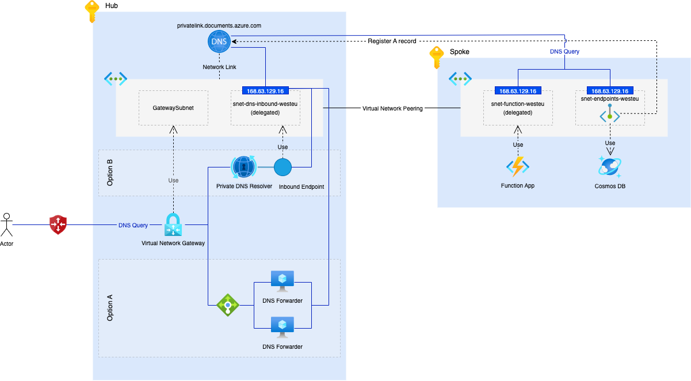

# Introduction 



# Steps to reproduce

## Apply resources to Azure

```bash
# change directory to IaC
cd ./terraform
# Deploy infrastructure
terraform init
terraform apply
```

## P2S VPN connection

- Download the Azure VPN client
- Download the P2S Configuration bundle from the Azure Portal
- Import the configuration file into the VPN client
- Connect to Azure

## Name resolution

```bash
nslookup cosmos-private-dns-westeu.documents.azure.com 10.0.0.4                                                        08:35:44
Server:		10.0.0.4
Address:	10.0.0.4#53

Non-authoritative answer:
cosmos-private-dns-westeu.documents.azure.com	canonical name = cosmos-private-dns-westeu.privatelink.documents.azure.com.
Name:	cosmos-private-dns-westeu.privatelink.documents.azure.com
Address: 172.16.0.4
```

> The IP address `10.0.0.4` is used to enable name resolution via the Private DNS Resolver (it is the IP address 
> of the provisioned endpoint). There seems to be a way to configure a DNS server in the VPN client - so that the 
> resolution works without an explicit DNS server.